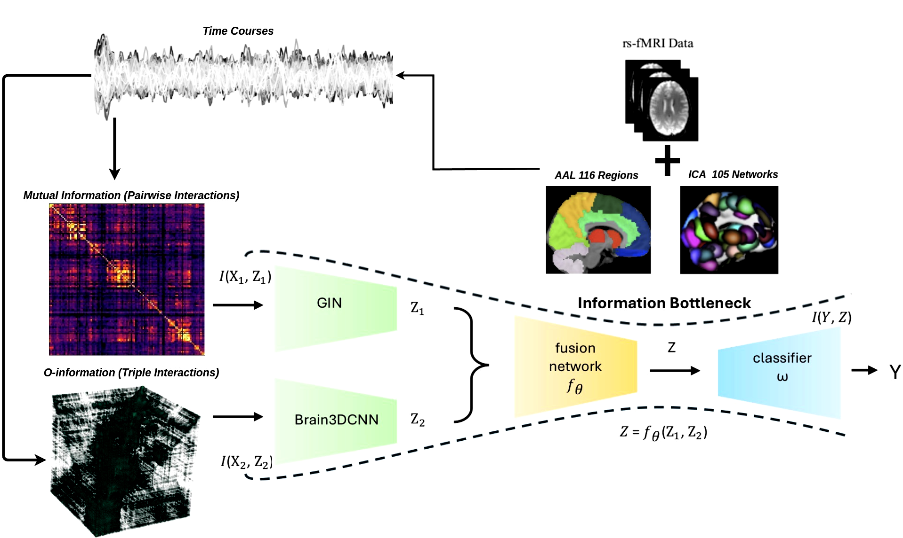
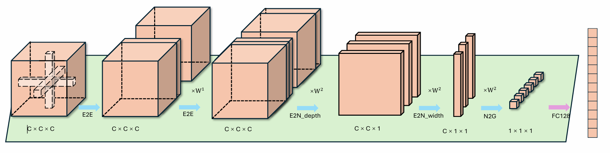

# MvHo-IB: Multi-View Higher-Order Information Bottleneck for Brain Disorder Diagnosis

<div align="center">

[English](README.md) | [中文](README_ch.md)

</div>

Code for "[MvHo-IB: Multi-View Higher-Order Information Bottleneck for Brain Disorder Diagnosis](https://arxiv.org/pdf/2507.02847)", MICCAI-25.

## 📋 Method Overview



Our MvHo-IB framework processes fMRI time series data through a multi-view learning architecture. The pipeline estimates functional connectivity patterns and feeds them into dual processing paths. The framework learns a joint representation $Z = f_{\theta}(Z_1, Z_2)$ by optimizing the information bottleneck objective: maximizing $I(Y; Z)$ while minimizing $I(X_1; Z_1) + I(X_2; Z_2)$. View 1 processes pairwise interactions through mutual information matrices, while View 2 captures higher-order triple interactions using $\mathcal{O}$-information 3D tensors.

## 📊 Supported Datasets

- **UCLA**
- **ADNI**
- **EOEC**

## 🛠️ Requirements

- Python 3.8+
- PyTorch 1.10+
- PyTorch Geometric
- NumPy, scikit-learn, PyYAML, tqdm

## 📦 Installation

```bash
git clone https://github.com/zky04/MvHo-IB.git
cd MvHo-IB
pip install -r requirements.txt
pip install torch-geometric
```

## 🎯 Quick Start

### 1. Prepare Data
Place your dataset files in the `data/` directory:
- `x1_[dataset].pt`: First view data (e.g., functional connectivity)
- `x2_o_[dataset].pt`: Second view data (e.g., higher-order interactions)
- The way to preprocess datasate will coming soon...
 
Example structure:
```
data/
├── x1_ucla.pt
├── x2_o_ucla.pt
├── x1_adni.pt
└── x2_o_adni.pt
```

### 2. Configure Experiment
Edit `config.yaml` to set dataset and hyperparameters:

### 3. Run Training
```bash
python main.py
```
### Brain3DCNN Architecture



The Brain3DCNN architecture is a specialized design that exploits the topological locality of structural brain networks to enhance $\mathcal{O}$-information representation learning. This hierarchical design captures multi-scale brain connectivity patterns for accurate disorder diagnosis.

## 📁 Project Structure

```
MvHo-IB/
├── main.py              # Main entry point
├── config.yaml          # Configuration file
├── requirements.txt     # Dependencies
├── src/                 # Source code
│   ├── models/          # Neural network models
│   │   ├── gin_model.py        # GIN network
│   │   ├── brain3dcnn.py       # Brain3DCNN
│   │   └── fusion_model.py     # Feature fusion
│   ├── data/            # Data processing
│   │   ├── dataset.py          # Dataset classes
│   │   └── data_loader.py      # Data loading
│   ├── utils/           # Utility functions
│   │   ├── info_bottleneck.py  # Information bottleneck
│   │   ├── evaluator.py        # Evaluation metrics
│   │   └── config_utils.py     # Configuration processing
│   └── trainer/         # Trainer
│       └── trainer.py          # Training logic
└── experiments/         # Experimental results
```

## 📝 Citation

Please kindly cite our paper if you find this project helpful.

```bibtex
@misc{zhang2025mvhoibmultiviewhigherorderinformation,
      title={MvHo-IB: Multi-View Higher-Order Information Bottleneck for Brain Disorder Diagnosis}, 
      author={Kunyu Zhang and Qiang Li and Shujian Yu},
      year={2025},
      eprint={2507.02847},
      archivePrefix={arXiv},
      primaryClass={cs.LG},
      url={https://arxiv.org/abs/2507.02847}, 
}
```
