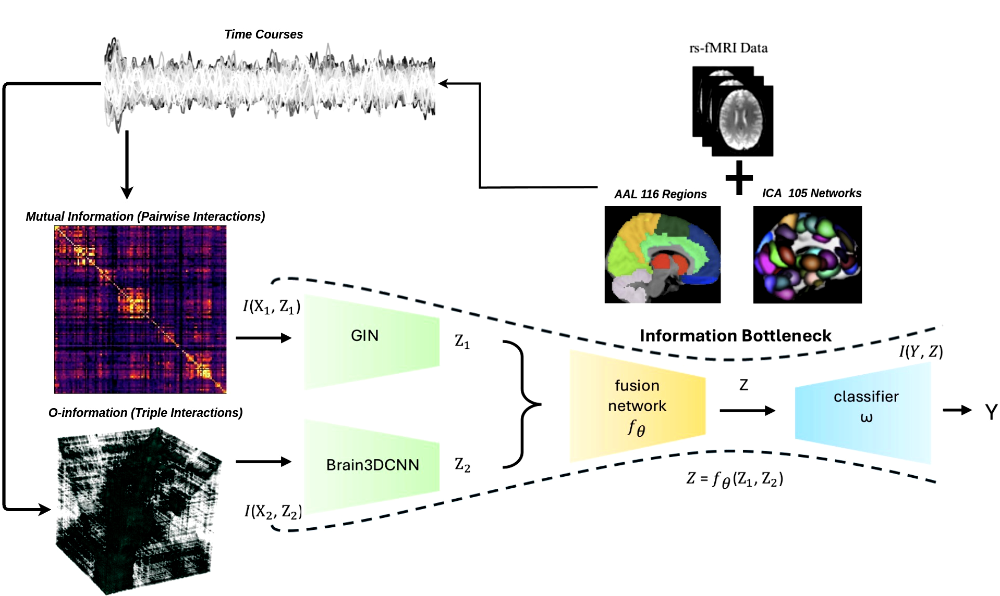
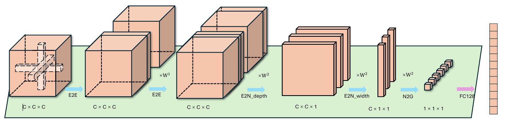

# MvHo-IB: Multi-View Higher-Order Information Bottleneck for Brain Disorder Diagnosis

[English](README.md) | [中文](README_ch.md)

"MvHo-IB: Multi-View Higher-Order Information Bottleneck for Brain Disorder Diagnosis", MICCAI-25 的代码实现。

## 🚀 主要特性

- **多视图学习**: 同时利用脑网络的成对连接和高阶交互信息
- **信息瓶颈原理**: 通过Rényi熵正则化提高模型泛化能力
- **高阶交互建模**: 基于O-information量化三元组脑区间的协同/冗余关系
- **端到端训练**: 统一的框架同时优化两个视图的特征提取和融合
- **灵活配置**: 支持多种数据集和分类模式

## 📋 方法概述



我们的MvHo-IB框架处理使用自动解剖标记(AAL)模板提取的fMRI时间序列数据。该流水线估计功能连接模式并将其输入多视图学习架构。框架通过优化信息瓶颈目标学习联合表示 \(Z = f_{\theta}(Z_1, Z_2)\)：最大化 \(I(Y; Z)\) 同时最小化 \(I(X_1; Z_1) + I(X_2; Z_2)\)。视图1通过互信息矩阵处理成对交互，视图2使用 \(\mathcal{O}\)-information 3D张量捕获高阶三元交互。

## 📊 支持的数据集

- **UCLA**: 自闭症谱系障碍 vs 典型发育
- **ADNI**: 阿尔茨海默病分类（支持3分类和多种二分类模式）
- **EOEC**: 脑疾病分类

### ADNI分类模式
- `three_class`: AD vs MCI vs NC (3分类)
- `binary_ad_nc`: AD vs NC (2分类)
- `binary_ad_mci`: AD vs MCI (2分类)
- `binary_mci_nc`: MCI vs NC (2分类)

## 🛠️ 环境要求

- Python 3.8+
- PyTorch 1.10+
- PyTorch Geometric
- NumPy, scikit-learn, PyYAML, tqdm

## 📦 安装

```bash
git clone https://github.com/zky04/MvHo-IB.git
cd MvHo-IB
pip install -r requirements.txt
pip install torch-geometric
```

## 🎯 快速开始

### 1. 准备数据
将数据集文件放在 `data/` 目录中：
- `x1_[dataset].pt`: 第一视图数据（如功能连接）
- `x2_o_[dataset].pt`: 第二视图数据（如高阶交互）

目录结构示例：
```
data/
├── x1_ucla.pt
├── x2_o_ucla.pt
├── x1_adni.pt
└── x2_o_adni.pt
```

### 2. 配置实验
编辑 `config.yaml` 设置所需的数据集：

```yaml
# 数据集配置 - 简单更改数据集名称
dataset_name: "UCLA"  # 选项: "UCLA", "ADNI", "EOEC"

# 对于ADNI，还可以指定分类模式
datasets:
  ADNI:
    mode: "three_class"  # 选项: "three_class", "binary_ad_nc", "binary_ad_mci", "binary_mci_nc"
```

### 3. 运行训练
```bash
python main.py
```

模型将自动：
- 加载指定的数据集
- 初始化多视图架构
- 使用信息瓶颈正则化进行训练
- 保存最佳模型和结果

## ⚙️ 模型架构

该框架由三个主要组件组成：

1. **GIN网络**: 处理成对脑连接（第一视图）
2. **Brain3DCNN**: 处理高阶交互（第二视图）
3. **信息瓶颈**: 应用Rényi熵正则化以获得更好的泛化性

### Brain3DCNN架构



Brain3DCNN架构通过多个专门层处理脑网络数据：E2E卷积用于边级特征提取，E2N滤波用于区域聚合，N2G层用于全局整合，以及全连接层用于分类。这种分层设计捕获多尺度脑连接模式以实现准确的疾病诊断。

### 关键参数
- `gin_embedding_dim`: GIN输出维度（默认：128）
- `cnn_embedding_dim`: CNN输出维度（默认：128）
- `beta_gin`: GIN的信息瓶颈权重（默认：0.1）
- `beta_cnn`: CNN的信息瓶颈权重（默认：0.1）
- `use_ib`: 启用/禁用信息瓶颈（默认：true）

## 📈 消融实验

该框架支持通过修改配置进行消融实验：

```yaml
# 禁用信息瓶颈
use_ib: false

# 仅使用一个视图
fusion_method: "gin_only"  # 或 "cnn_only"

# 调整正则化强度
beta_gin: 0.0  # 禁用GIN正则化
beta_cnn: 0.1  # 保持CNN正则化
```

## 📁 项目结构

```
MvHo-IB/
├── main.py              # 主程序入口
├── config.yaml          # 配置文件
├── requirements.txt     # 依赖包
├── README.md            # 英文说明文档
├── README_ch.md         # 中文说明文档
├── .gitignore          # Git忽略规则
├── images/              # 图片和图表
│   ├── ovreview.png            # 方法概述
│   └── 3DBrainCNN.png          # Brain3DCNN架构
├── src/                 # 源代码
│   ├── models/          # 神经网络模型
│   │   ├── gin_model.py        # 连接性GIN网络
│   │   ├── brain3dcnn.py       # 高阶交互3D CNN
│   │   └── fusion_model.py     # 多视图特征融合
│   ├── data/            # 数据处理
│   │   ├── dataset.py          # 数据集类
│   │   └── data_loader.py      # 数据加载工具
│   ├── utils/           # 工具函数
│   │   ├── info_bottleneck.py  # 信息瓶颈实现
│   │   ├── evaluator.py        # 评估指标
│   │   └── config_utils.py     # 配置工具
│   └── trainer/         # 训练模块
│       └── trainer.py          # 训练和验证逻辑
├── experiments/         # 实验结果
│   └── runs/           # TensorBoard日志
└── data/               # 数据集目录（手动创建）
```

## 📊 结果

训练结果保存在：
- `experiments/runs/`: TensorBoard监控日志
- `best_model.pth`: 最佳模型检查点
- `results.json`: 最终评估指标

使用TensorBoard监控训练进度：
```bash
tensorboard --logdir experiments/runs
```

## 🔧 故障排除

### 常见问题

1. **CUDA内存不足**: 在config.yaml中减少批大小
2. **缺少数据文件**: 确保数据集文件在 `data/` 目录中
3. **导入错误**: 安装匹配CUDA版本的PyTorch Geometric
4. **标签范围错误**: 检查ADNI分类模式是否与数据匹配

### 调试模式
通过设置启用详细日志记录：
```yaml
debug: true
log_level: "DEBUG"
```

## 📝 引用

如果您在研究中使用此代码，请引用：
```bibtex
@inproceedings{mvho-ib-2025,
  title={MvHo-IB: Multi-View Higher-Order Information Bottleneck for Brain Disorder Diagnosis},
  author={[Authors]},
  booktitle={MICCAI},
  year={2025}
}
```

## 📄 许可证

本项目采用MIT许可证 - 详见LICENSE文件。

## 🤝 贡献

欢迎贡献！请随时提交Pull Request。
